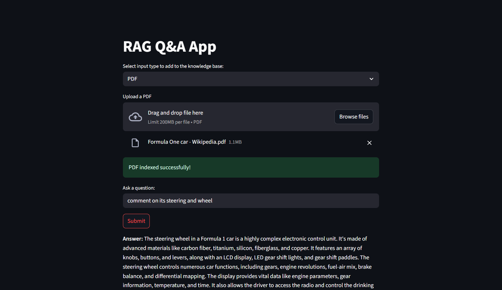
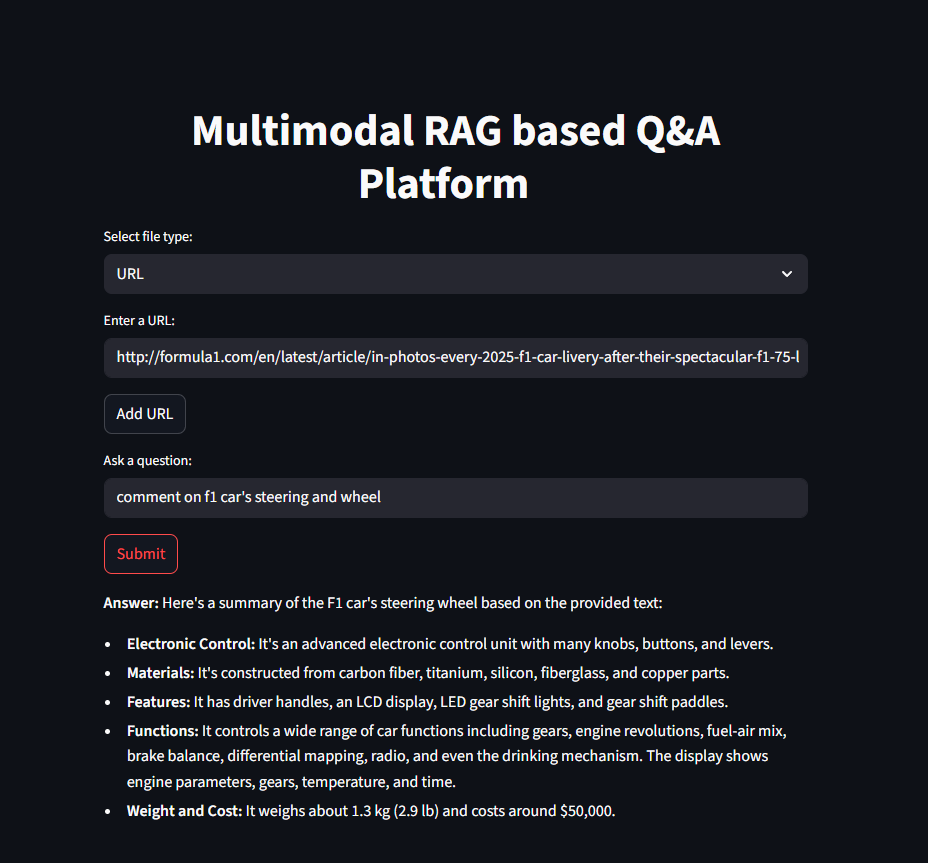
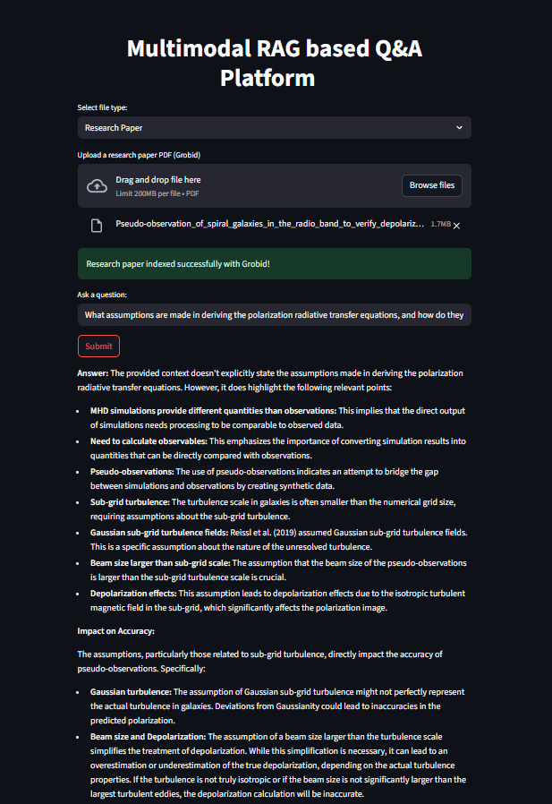
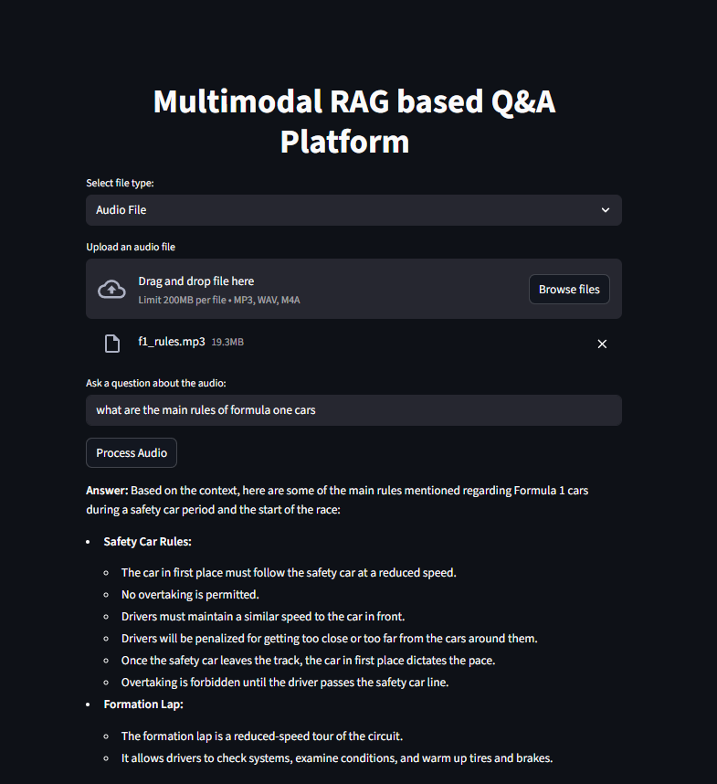
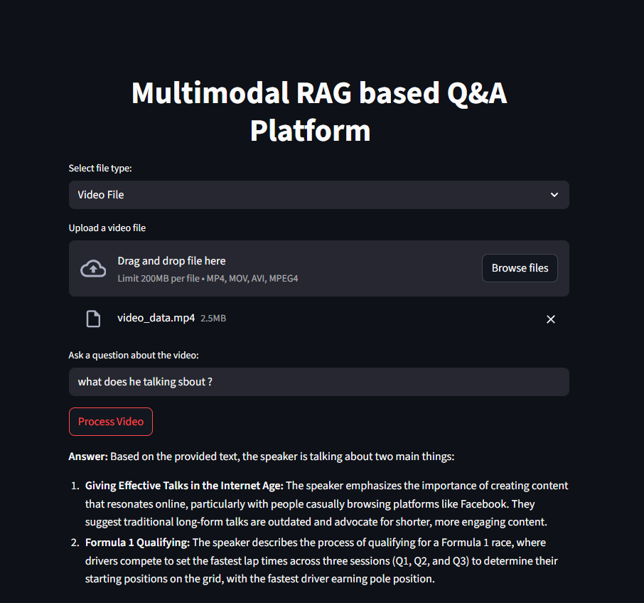

# Multimodal RAG-based Q&A Platform

A powerful, easy-to-use platform for question answering over documents, web pages, research papers, audio, and video files using Retrieval-Augmented Generation (RAG) with Google Gemini and Qdrant.

## Features
- **PDF, URL, and Research Paper (Grobid) ingestion**
- **Audio and Video Q&A** (automatic transcription and semantic search)
- **Streamlit web interface**
- **Google Gemini LLM integration**
- **In-memory Qdrant vector store**

## Demo






---

## Setup Instructions

### 1. Clone the Repository
```bash
git clone https://github.com/himaenshuu/Multi_modal_rag-application
cd "my app"
```

### 2. Install Python Dependencies
It is recommended to use a virtual environment:
```bash
python -m venv venv
venv\Scripts\activate  # On Windows
# or
source venv/bin/activate  # On Mac/Linux

pip install -r requirements.txt
```

### 3. Set Up Environment Variables
Create a `.env` file in the project root and add your Google Gemini API key:
```
GEMINI_API=your_google_gemini_api_key
```

### 4. Install FFmpeg (for Audio/Video Processing)
#### **Windows Setup:**
1. Download FFmpeg from the official site: [https://ffmpeg.org/download.html](https://ffmpeg.org/download.html)
2. Choose the Windows build (e.g., from [gyan.dev](https://www.gyan.dev/ffmpeg/builds/)).
3. Extract the downloaded ZIP (e.g., `ffmpeg-release-essentials.zip`).
4. Move the extracted `ffmpeg` folder to a location like `C:\ffmpeg`.
5. Add `C:\ffmpeg\bin` to your Windows PATH:
   - Open **System Properties** > **Environment Variables**
   - Under **System variables**, find and select `Path`, then click **Edit**
   - Click **New** and add: `C:\ffmpeg\bin`
   - Click **OK** to save
6. Open a new Command Prompt and run:
   ```
   ffmpeg -version
   ```
   You should see version info if installed correctly.

---

## Running the App
```bash
streamlit run app.py
```

The app will open in your browser. Use the interface to upload files, add URLs, or ask questions!

---

## File Structure
```
my app/
  app.py                  # Streamlit UI
  rag_app.py              # PDF, URL, research paper RAG logic
  audio_video_rag.py      # Audio/Video RAG logic
  requirements.txt        # Python dependencies
  .gitignore              # Git ignore rules
  README.md               # This file
```

---

## Notes
- Temporary files (audio, video, PDFs) are saved as `temp_*` and ignored by git.
- For research papers, Grobid parser is used for better structure extraction.
- All data is stored in-memory.

---

## License
MIT License 
